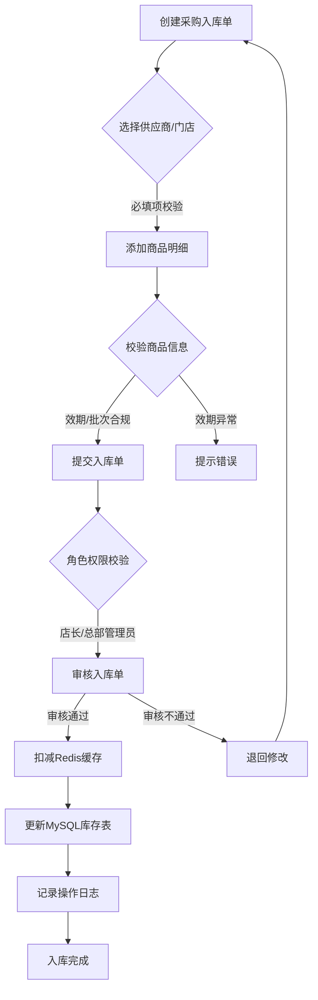
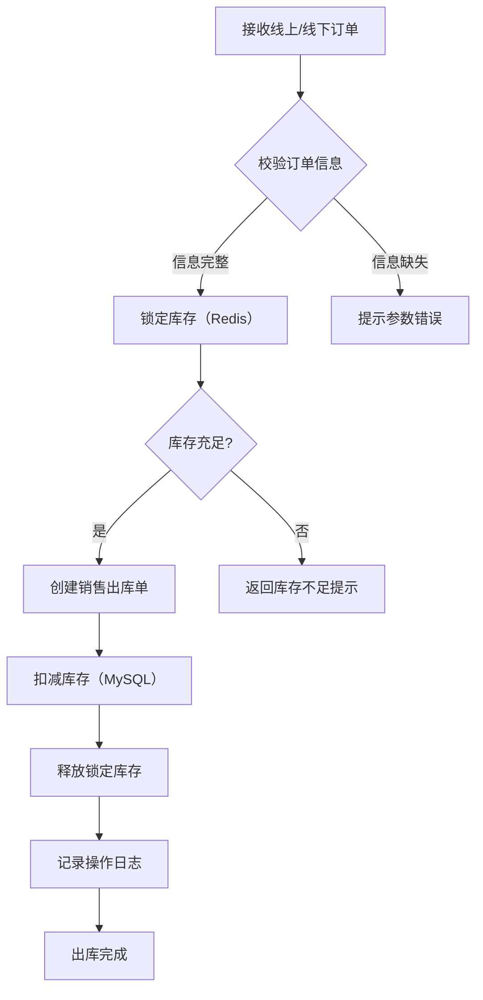
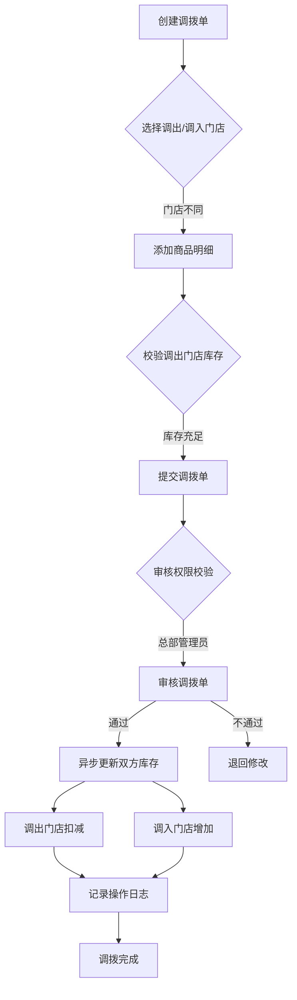

# 连锁零售门店库存管理系统后端管理文档
## 一、系统架构
### 1.1 技术栈选型
| 层级         | 技术选型                          | 说明                                                                 |
|--------------|-----------------------------------|----------------------------------------------------------------------|
| 后端框架     | Spring Boot 2.7.x + Spring MVC   | 快速构建企业级应用，提供RESTful API支持                             |
| 数据库       | MySQL 8.0                         | 存储业务数据（门店、商品、库存、订单等）                             |
| 缓存         | Redis 6.x                         | 缓存用户登录状态、热点库存数据，提升系统性能                         |
| 消息队列     | RabbitMQ 3.12.x                   | 异步处理库存更新、订单同步等耗时操作，解耦业务模块                   |
| ORM框架      | MyBatis-Plus 3.5.x                | 简化数据库操作，支持代码生成、分页查询、逻辑删除等功能               |
| 接口文档     | Knife4j 3.x（基于Swagger）        | 自动生成在线接口文档，支持接口调试                                   |
| 安全框架     | Spring Security + JWT              | 实现用户认证、角色权限控制                                           |
| 监控         | Spring Boot Actuator + Prometheus | 监控系统运行状态、接口性能、数据库连接等                             |

### 1.2 系统分层架构
```
┌─────────────────────────────────────────────────────────┐
│                        接入层                             │
│  Nginx（负载均衡、静态资源） + Spring Boot（API网关）    │
└─────────────────────────────────────────────────────────┘
                            ↓
┌─────────────────────────────────────────────────────────┐
│                        业务层                             │
│  ┌──────────────┐  ┌──────────────┐  ┌──────────────┐ │
│  │ 基础信息模块  │  │ 库存核心模块  │  │ 数据统计模块  │ │
│  └──────────────┘  └──────────────┘  └──────────────┘ │
│  ┌──────────────┐  ┌──────────────┐  ┌──────────────┐ │
│  │ 全渠道对接模块│  │ 用户权限模块  │  │ 异步任务模块  │ │
│  └──────────────┘  └──────────────┘  └──────────────┘ │
└─────────────────────────────────────────────────────────┘
                            ↓
┌─────────────────────────────────────────────────────────┐
│                        数据层                             │
│  ┌──────────────┐  ┌──────────────┐  ┌──────────────┐ │
│  │   MySQL      │  │    Redis     │  │  RabbitMQ    │ │
│  │ （业务数据）  │  │ （缓存数据）  │  │ （消息队列）  │ │
│  └──────────────┘  └──────────────┘  └──────────────┘ │
└─────────────────────────────────────────────────────────┘
```

### 1.3 核心数据库表设计（节选）
| 表名          | 说明          | 核心字段                                  |
|---------------|---------------|-------------------------------------------|
| store         | 门店信息表    | store_id, store_name, address, status    |
| product       | 商品信息表    | product_id, product_name, category, barcode, expiry_date, warning_stock |
| inventory     | 库存表        | inventory_id, store_id, product_id, stock_num, batch_no |
| inbound_order | 采购入库单表  | order_id, supplier_id, store_id, status, create_time |
| outbound_order| 销售出库单表  | order_id, channel, store_id, status, create_time |
| transfer_order| 跨店调拨单表  | order_id, out_store_id, in_store_id, status |
| user          | 用户表        | user_id, username, password, role, store_id |
| operation_log | 操作日志表    | log_id, user_id, operation, create_time  |

---

## 二、程序流程图
### 2.1 采购入库流程


### 2.2 销售出库流程


### 2.3 跨店调拨流程


---

## 三、接口文档（基于Knife4j）
### 3.1 接口基础信息
- **Base URL**: `http://localhost:8080/api`
- **认证方式**: JWT Token（请求头添加 `Authorization: Bearer {token}`）
- **数据格式**: JSON
- **接口文档地址**: `http://localhost:8080/doc.html`

### 3.2 核心接口示例
#### （1）基础信息模块 - 门店管理
| 接口名称 | 新增门店 |
|----------|----------|
| URL      | `/store/add` |
| Method   | POST |
| 权限要求 | 总部管理员 |
| 请求参数 |
| 参数名 | 类型 | 必填 | 说明 |
|--------|------|------|------|
| storeName | String | 是 | 门店名称 |
| address | String | 是 | 门店地址 |
| contact | String | 是 | 联系人 |
| phone | String | 是 | 联系电话 |
| **响应参数** |
| 参数名 | 类型 | 说明 |
|--------|------|------|
| code | Integer | 状态码（200=成功） |
| message | String | 提示信息 |
| data | Long | 新增门店ID |
| **请求示例** |
```json
{
  "storeName": "长沙岳麓店",
  "address": "湖南省长沙市岳麓区",
  "contact": "张三",
  "phone": "13800138000"
}
```
| **响应示例** |
```json
{
  "code": 200,
  "message": "新增成功",
  "data": 1001
}
```

#### （2）库存核心模块 - 采购入库
| 接口名称 | 创建采购入库单 |
|----------|----------|
| URL      | `/inventory/inbound` |
| Method   | POST |
| 权限要求 | 门店店长/店员 |
| 请求参数 |
| 参数名 | 类型 | 必填 | 说明 |
|--------|------|------|------|
| supplierId | Long | 是 | 供应商ID |
| storeId | Long | 是 | 入库门店ID |
| items | List | 是 | 商品明细 |
| items[0].productId | Long | 是 | 商品ID |
| items[0].num | Integer | 是 | 入库数量 |
| items[0].batchNo | String | 是 | 批次号 |
| items[0].expiryDate | Date | 是 | 效期 |
| **响应参数** |
| 参数名 | 类型 | 说明 |
|--------|------|------|
| code | Integer | 状态码 |
| message | String | 提示信息 |
| data | String | 入库单号 |

#### （3）数据统计模块 - 库存总览
| 接口名称 | 获取各门店库存总量 |
|----------|----------|
| URL      | `/statistics/inventory-overview` |
| Method   | GET |
| 权限要求 | 总部管理员/门店店长 |
| 请求参数 |
| 参数名 | 类型 | 必填 | 说明 |
|--------|------|------|------|
| startTime | Date | 否 | 开始时间 |
| endTime | Date | 否 | 结束时间 |
| storeId | Long | 否 | 门店ID（不传则查所有） |
| **响应参数** |
| 参数名 | 类型 | 说明 |
|--------|------|------|
| code | Integer | 状态码 |
| data | List | 库存数据列表 |
| data[0].storeId | Long | 门店ID |
| data[0].storeName | String | 门店名称 |
| data[0].totalStock | Integer | 库存总量 |
| data[0].totalAmount | BigDecimal | 库存金额 |

---

## 四、测试用例设计
### 4.1 功能测试用例（节选）
| 用例编号 | 模块       | 测试场景               | 前置条件               | 测试步骤                                                                 | 预期结果                                                                 |
|----------|------------|------------------------|------------------------|--------------------------------------------------------------------------|--------------------------------------------------------------------------|
| TC001    | 采购入库   | 正常采购入库           | 供应商、商品、门店已存在 | 1. 调用采购入库接口，传入合法参数<br>2. 审核入库单<br>3. 查询库存表   | 1. 入库单创建成功<br>2. 审核通过<br>3. 对应门店商品库存增加，操作日志记录 |
| TC002    | 采购入库   | 商品效期已过           | 商品效期小于当前日期   | 调用采购入库接口，传入效期已过的商品                                   | 接口返回400错误，提示“商品效期已过”，库存无变化                       |
| TC003    | 销售出库   | 库存充足               | 商品库存≥销售数量      | 1. 接收订单<br>2. 调用销售出库接口<br>3. 查询库存                     | 1. 库存锁定成功<br>2. 库存扣减正确<br>3. 订单状态更新为“已出库”       |
| TC004    | 销售出库   | 库存不足               | 商品库存<销售数量      | 调用销售出库接口                                                         | 接口返回400错误，提示“库存不足”，订单状态为“待处理”                     |
| TC005    | 跨店调拨   | 调出门店库存不足       | 调出门店商品库存<调拨数量 | 调用跨店调拨接口                                                         | 接口返回400错误，调拨单创建失败                                         |
| TC006    | 用户权限   | 店员越权访问总部数据   | 登录账号为“门店店员”   | 调用“获取所有门店库存”接口（需总部权限）                               | 接口返回403错误，提示“无权限访问”                                       |
| TC007    | 数据一致性 | 高频销售后库存同步     | 模拟100并发销售请求    | 1. 发送并发请求<br>2. 查询最终库存<br>3. 核对销售数量与库存扣减总和   | 1. 无超卖现象<br>2. 最终库存=初始库存-销售总和<br>3. 无数据丢失       |

### 4.2 性能测试用例
| 用例编号 | 测试场景               | 并发数 | 持续时间 | 性能指标要求                          |
|----------|------------------------|--------|----------|---------------------------------------|
| PT001    | 销售出库接口并发测试   | 200    | 5分钟    | 响应时间≤500ms，成功率≥99.9%          |
| PT002    | 库存总览查询并发测试   | 100    | 3分钟    | 响应时间≤300ms，数据库连接池无溢出     |
| PT003    | 批量导入商品并发测试   | 50     | 2分钟    | 导入1000条商品≤10秒，数据无重复        |

### 4.3 安全测试用例
| 用例编号 | 测试场景               | 测试方法                                                                 | 预期结果                                                                 |
|----------|------------------------|--------------------------------------------------------------------------|--------------------------------------------------------------------------|
| ST001    | SQL注入攻击            | 在商品查询接口传入 `productName: ' OR '1'='1`                          | 接口返回400错误，无数据泄露，日志记录攻击尝试                           |
| ST002    | 越权访问               | 使用门店店员Token调用总部管理员专属接口（如删除门店）                   | 接口返回403错误，操作被拦截                                             |
| ST003    | Token过期验证          | 使用过期24小时的Token调用接口                                           | 接口返回401错误，提示“Token已过期”，需重新登录                          |

---

## 五、接口自动化代码（Python + pytest + requests）
### 5.1 项目结构
```
inventory-api-test/
├── config/
│   └── settings.py       # 配置文件（base_url、账号等）
├── common/
│   ├── request_util.py   # 封装requests请求
│   └── auth_util.py      # JWT Token获取
├── testcases/
│   ├── test_store.py     # 门店模块测试用例
│   ├── test_inbound.py   # 采购入库测试用例
│   └── test_statistics.py# 数据统计测试用例
├── data/
│   └── test_data.json    # 测试数据
├── reports/              # 测试报告
├── pytest.ini            # pytest配置
└── requirements.txt      # 依赖包
```

### 5.2 核心代码实现
#### （1）配置文件 `config/settings.py`
```python
import os

BASE_URL = os.getenv("BASE_URL", "http://localhost:8080/api")
# 测试账号
ADMIN_USER = {
    "username": "admin",
    "password": "admin123"  # 实际项目中需加密存储
}
STORE_USER = {
    "username": "store_manager",
    "password": "store123",
    "store_id": 1001
}
```

#### （2）请求封装 `common/request_util.py`
```python
import requests
from config.settings import BASE_URL

class RequestUtil:
    def __init__(self):
        self.base_url = BASE_URL
        self.session = requests.Session()
        self.token = None

    def set_token(self, token):
        self.token = token
        self.session.headers.update({"Authorization": f"Bearer {token}"})

    def send_request(self, method, url, **kwargs):
        full_url = f"{self.base_url}{url}"
        try:
            response = self.session.request(method=method, url=full_url, **kwargs)
            response.raise_for_status()  # 抛出HTTP错误
            return response.json()
        except requests.exceptions.RequestException as e:
            print(f"请求失败: {e}")
            return None

# 全局实例
request_util = RequestUtil()
```

#### （3）Token获取 `common/auth_util.py`
```python
from common.request_util import request_util
from config.settings import ADMIN_USER, STORE_USER

def get_admin_token():
    """获取总部管理员Token"""
    response = request_util.send_request(
        method="POST",
        url="/auth/login",
        json=ADMIN_USER
    )
    if response and response["code"] == 200:
        token = response["data"]["token"]
        request_util.set_token(token)
        return token
    raise Exception("获取管理员Token失败")

def get_store_token():
    """获取门店店长Token"""
    response = request_util.send_request(
        method="POST",
        url="/auth/login",
        json=STORE_USER
    )
    if response and response["code"] == 200:
        token = response["data"]["token"]
        request_util.set_token(token)
        return token
    raise Exception("获取门店Token失败")
```

#### （4）测试用例 `testcases/test_inbound.py`
```python
import pytest
from common.request_util import request_util
from common.auth_util import get_store_token, get_admin_token
from config.settings import STORE_USER

# 前置条件：获取Token
@pytest.fixture(scope="module", autouse=True)
def setup_module():
    get_store_token()  # 门店店长Token用于创建入库单
    yield
    # 后置清理：可删除测试数据

# 测试数据
test_inbound_data = [
    # 正常场景
    {
        "name": "正常采购入库",
        "supplier_id": 1,
        "store_id": STORE_USER["store_id"],
        "items": [{"product_id": 101, "num": 50, "batch_no": "B20251201", "expiry_date": "2026-12-31"}],
        "expected_code": 200
    },
    # 异常场景：效期已过
    {
        "name": "商品效期已过",
        "supplier_id": 1,
        "store_id": STORE_USER["store_id"],
        "items": [{"product_id": 101, "num": 10, "batch_no": "B20230101", "expiry_date": "2024-01-01"}],
        "expected_code": 400
    }
]

@pytest.mark.parametrize("test_data", test_inbound_data, ids=lambda x: x["name"])
def test_create_inbound(test_data):
    """测试创建采购入库单"""
    response = request_util.send_request(
        method="POST",
        url="/inventory/inbound",
        json={
            "supplierId": test_data["supplier_id"],
            "storeId": test_data["store_id"],
            "items": test_data["items"]
        }
    )
    assert response is not None, "请求无响应"
    assert response["code"] == test_data["expected_code"], f"状态码不符，期望{test_data['expected_code']}，实际{response['code']}"

def test_audit_inbound():
    """测试审核入库单（需管理员Token）"""
    # 1. 先创建一个待审核的入库单
    get_store_token()
    create_response = request_util.send_request(
        method="POST",
        url="/inventory/inbound",
        json={
            "supplierId": 1,
            "storeId": STORE_USER["store_id"],
            "items": [{"product_id": 102, "num": 30, "batch_no": "B20251202", "expiry_date": "2026-12-31"}]
        }
    )
    inbound_order_no = create_response["data"]
    
    # 2. 切换管理员Token审核
    get_admin_token()
    audit_response = request_util.send_request(
        method="POST",
        url="/inventory/inbound/audit",
        json={"orderNo": inbound_order_no, "status": "APPROVED"}
    )
    
    assert audit_response["code"] == 200, "审核失败"
    
    # 3. 验证库存是否增加
    inventory_response = request_util.send_request(
        method="GET",
        url="/inventory/detail",
        params={"storeId": STORE_USER["store_id"], "productId": 102}
    )
    assert inventory_response["data"]["stockNum"] >= 30, "库存未增加"
```

#### （5）`pytest.ini` 配置
```ini
[pytest]
testpaths = testcases
python_files = test_*.py
python_classes = Test*
python_functions = test_*
addopts = -v --html=reports/report.html --self-contained-html
```

#### （6）`requirements.txt` 依赖
```txt
pytest>=7.0.0
requests>=2.28.0
pytest-html>=3.1.1
allure-pytest>=2.12.0  # 可选：生成Allure报告
```

### 5.3 运行方式
```bash
# 1. 安装依赖
pip install -r requirements.txt

# 2. 运行所有测试用例并生成HTML报告
pytest

# 3. 运行指定模块
pytest testcases/test_inbound.py -v

# 4. 生成Allure报告（需先安装Allure命令行工具）
pytest --alluredir=reports/allure-results
allure serve reports/allure-results
```