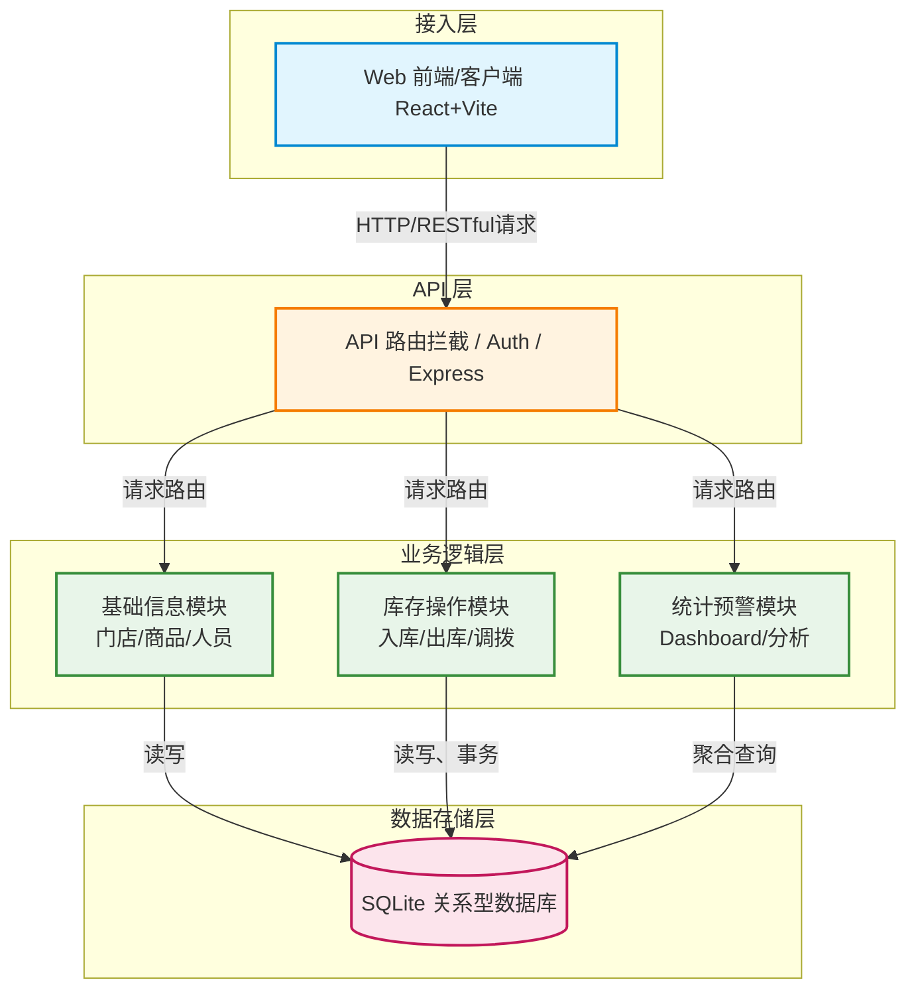
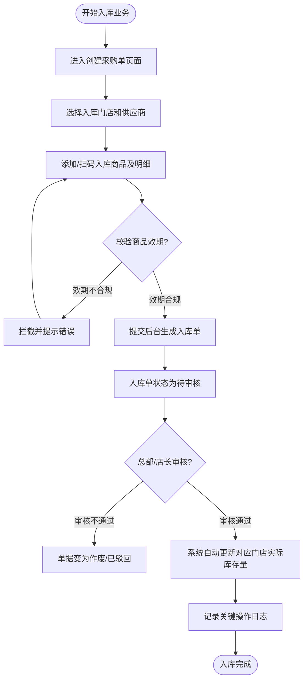
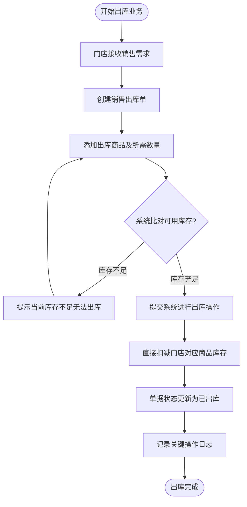
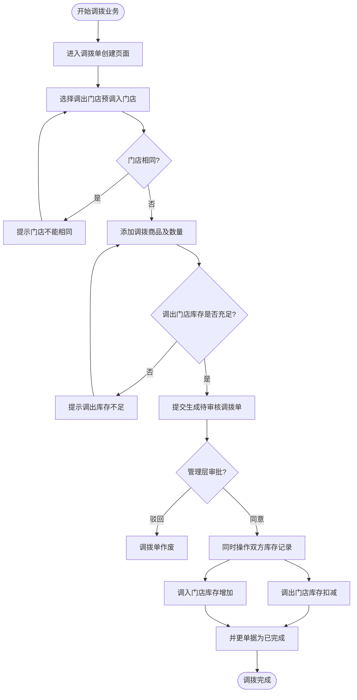

# 系统业务流程图与架构图

本文档包含连锁零售门店库存管理系统的核心架构及核心业务流程图，可直接用于论文插图。可以使用 Markdown 预览工具或粘贴到 Draw.io (Mermaid 插件) 中导出图片。

## 1. 系统分层架构图

```mermaid
graph TD
    classDef client fill:#e1f5fe,stroke:#0288d1,stroke-width:2px;
    classDef api fill:#fff3e0,stroke:#f57c00,stroke-width:2px;
    classDef service fill:#e8f5e9,stroke:#388e3c,stroke-width:2px;
    classDef data fill:#fce4ec,stroke:#c2185b,stroke-width:2px;

    subgraph 接入层
        A[Web 前端/客户端 React+Vite]:::client
    end

    subgraph API 层
        B[API 路由拦截 / Auth / Express]:::api
    end

    subgraph 业务逻辑层
        C1[基础信息模块<br>门店/商品/人员]:::service
        C2[库存操作模块<br>入库/出库/调拨]:::service
        C3[统计预警模块<br>Dashboard/分析]:::service
    end

    subgraph 数据存储层
        D1[(SQLite 关系型数据库)]:::data
    end

    A -->|HTTP/RESTful请求| B
    B -->|请求路由| C1
    B -->|请求路由| C2
    B -->|请求路由| C3
    C1 -->|读写| D1
    C2 -->|读写、事务| D1
    C3 -->|聚合查询| D1
```

## 2. 采购入库核心业务流程图

```mermaid
flowchart TD
    Start([开始入库业务]) --> A[进入创建采购单页面]
    A --> B[选择入库门店和供应商]
    B --> C[添加/扫码入库商品及明细]
    C --> D{校验商品效期?}
    D -- 效期不合规 --> E[拦截并提示错误]
    E --> C
    D -- 效期合规 --> F[提交后台生成入库单]
    F --> G[入库单状态为待审核]
    G --> H{总部/店长审核?}
    H -- 审核不通过 --> I[单据变为作废/已驳回]
    H -- 审核通过 --> J[系统自动更新对应门店实际库存量]
    J --> K[记录关键操作日志]
    K --> End([入库完成])
```

## 3. 销售出库核心业务流程图

```mermaid
flowchart TD
    Start([开始出库业务]) --> A[门店接收销售需求]
    A --> B[创建销售出库单]
    B --> C[添加出库商品及所需数量]
    C --> D{系统比对可用库存?}
    D -- 库存不足 --> E[提示当前库存不足无法出库]
    E --> C
    D -- 库存充足 --> F[提交系统进行出库操作]
    F --> G[直接扣减门店对应商品库存]
    G --> H[单据状态更新为已出库]
    H --> I[记录关键操作日志]
    I --> End([出库完成])
```

## 4. 跨店调拨核心业务流程图

```mermaid
flowchart TD
    Start([开始调拨业务]) --> A[进入调拨单创建页面]
    A --> B[选择调出门店预调入门店]
    B --> C{门店相同?}
    C -- 是 --> D[提示门店不能相同]
    D --> B
    C -- 否 --> E[添加调拨商品及数量]
    E --> F{调出门店库存是否充足?}
    F -- 否 --> G[提示调出库存不足]
    G --> E
    F -- 是 --> H[提交生成待审核调拨单]
    H --> I{管理层审批?}
    I -- 驳回 --> J[调拨单作废]
    I -- 同意 --> K[同时操作双方库存记录]
    K --> L[调出门店库存扣减]
    K --> M[调入门店库存增加]
    L --> N[并更单据为已完成]
    M --> N
    N --> End([调拨完成])
```
